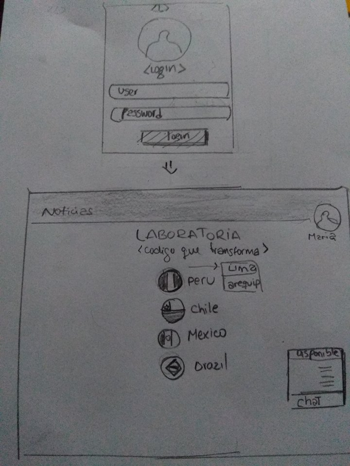
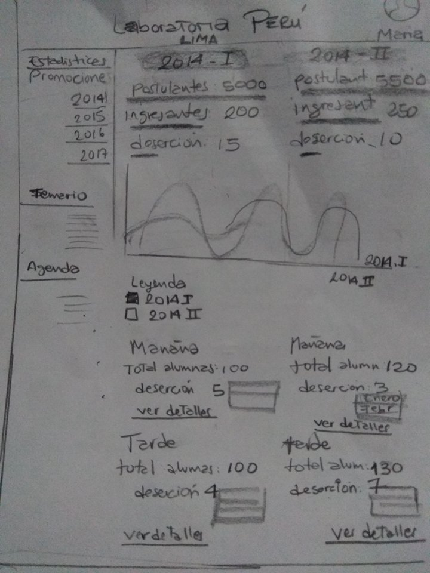
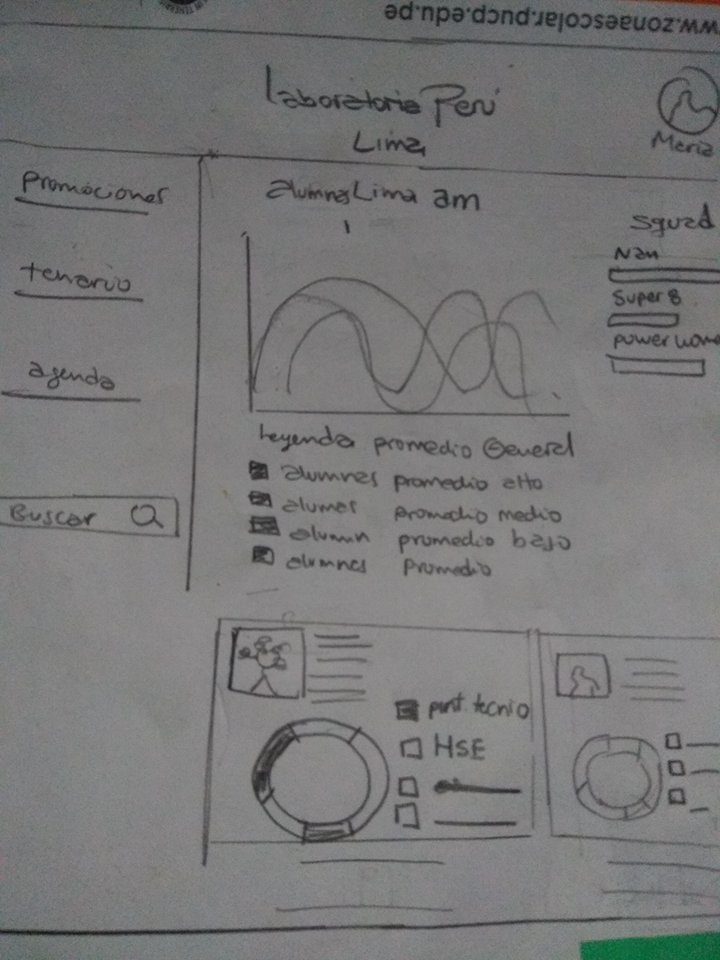

# SKECTH LABORATORIA
En este trabajo se realizoun sketch teniendo en cuenta:

•	# de alumnas inscritas

•	# de alumnas que desertaron

•	# y % de alumnas que pasan el criterio mínimo de evaluación

•	Promedio de notas por sprint

•	Promedio de notas HSE

•	Promedio de notas técnicas

A continuacion las imagenes  de los sketch realizados:

